# English Patch for Waiwai Check and Waiwai Kids

Here are the English patch for 3 Satellaview games (in 2 separate roms):
- WaiWai Check 11/15 Rerun | わいわいチェック 11/15 再放送 ([ROM Download](https://superfamicom.org/blog/2023/02/warios-first-event-and-pirates-that-beeps/))
- Waiwai Check 3/21 | わいわいチェック 3/21
- Yuki no Waiwai Kids 3/16 | 有紀のワイワイKIDS 3/16 ([ROM Download](https://superfamicom.org/blog/2012/11/new-rom-dump-but-i-dont-know-wai-im-releasing-these-now/))

I usually don't provide links to roms, but I make an exception since the Satellaview dumps are hard to find.
Waiwai Check 3/21 and Waiwai Kids 3/16 are contained in the same pack.

The three games are "spot the difference" games using the same engine.\
You have an animated image on the left and the mirrored version on the right with 5 differences.\
Moving the cursor around you have to find the differences, each worth different amount of points.
Some game modes are based on time, others on scores. There is also a 2 player mode.\
The "thinking challenge" gives you a code at the end, that you could send to the St.GIGA studio to be eligible for a prize.\
Yuki's Waiwai Kids has no 2 player mode, you play against a ruthless A.I. representing Yuki instead. 

The main menu has an option for Radio ON/Radio OFF (Select _Radio OFF_ or _Music ON_ to have the in game music) as the game were intended to be played while listening to the radio show.

The Waiwai Check games were part of the radio show [Hikaru Ijuin's King of After School (伊集院光の放課後の王様, Ijuin Hikaru no Houkago no Ousama )](https://ja.wikipedia.org/wiki/%E4%BC%8A%E9%9B%86%E9%99%A2%E5%85%89%E3%81%AE%E6%94%BE%E8%AA%B2%E5%BE%8C%E3%81%AE%E7%8E%8B%E6%A7%98) hosted by [Hikaru Ijūin](https://en.wikipedia.org/wiki/Hikaru_Ij%C5%ABin).

The game Yuki's Waiwai Kids was part of the radio show _Yuki Uchida's Dusk Street Kids_ (内田有紀の夕暮れストリートキッズ (Uchida Yuki no Yuugure SutoritoKizzu)).\
The show was hosted by [Yuki Uchida](https://en.wikipedia.org/wiki/Yuki_Uchida).

King of After School was recorded at St. Giga's studio in Jingūmae, Shibuya until February 1996.\
They moved the show to the Nintendo Tokyo Building studio in Asakusabashi, Taitō in March 1996.\
We can see that change in the address on the end game postcard.\
On the end game postcard, you can press Up and Down to scroll down the message.

## Patches

### Waiwai Check 11/15

Patch 1.0 (March 2023):\
[WaiWai Check 11-15 - English 1.0.zip](/patch/WaiWai%20Check%2011-15%20-%20English%201.0.zip) 

File/ROM SHA-1: 1725FF76E457F7A8D5E741BE9EDC549FAE145979\
File/ROM CRC32: C557DB3A

### Waiwai Check 3/21 + WaiWai Kids 3/16

Patch 1.0 (March 2023):\
[WaiWai Check 3-21 + WaiWai Kids 3-16 - English 1.0.zip](/patch/WaiWai%20Check%203-21%20%2B%20WaiWai%20Kids%203-16%20-%20English%201.0.zip) 

File/ROM SHA-1: FE67F40912E7C4D290EEB175A2BD2122BFA3AE8C
File/ROM CRC32: 17239E91

## Disclaimer

## Waiwai Check 11/15

_ | Screenshots
--- | ---
Japanese | 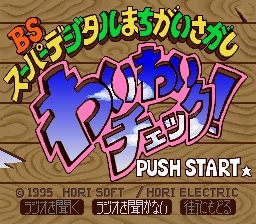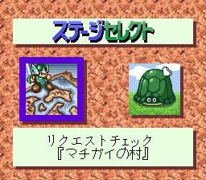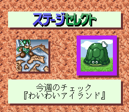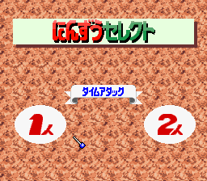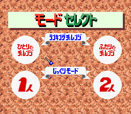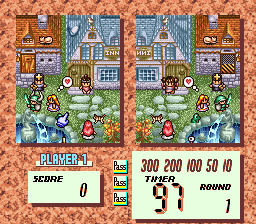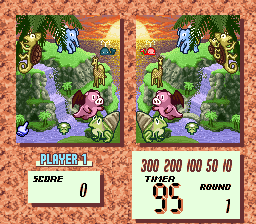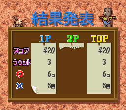
English | 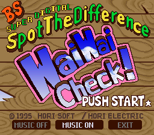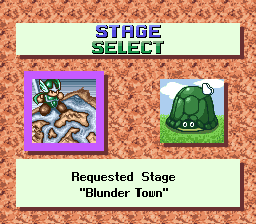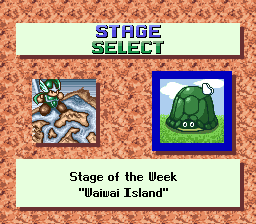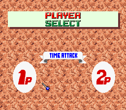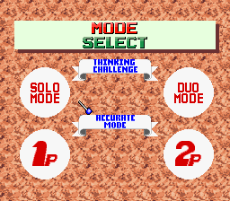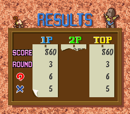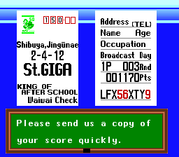

## Waiwai Check 3/21

_ | Screenshots
--- | ---
English | 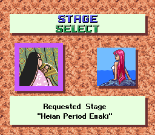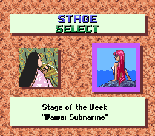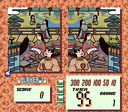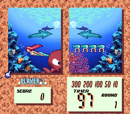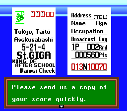

## Waiwai Kids 3/16

_ | Screenshots
--- | ---
English | 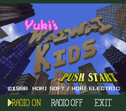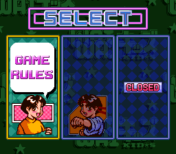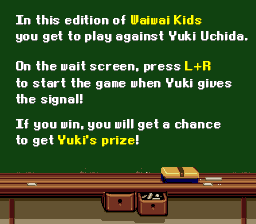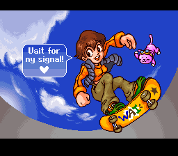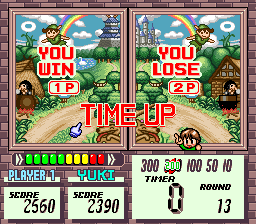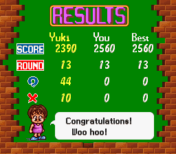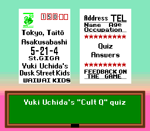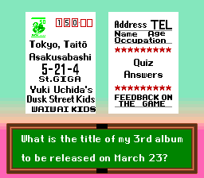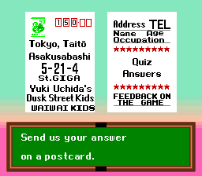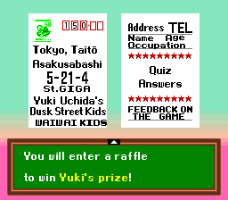
